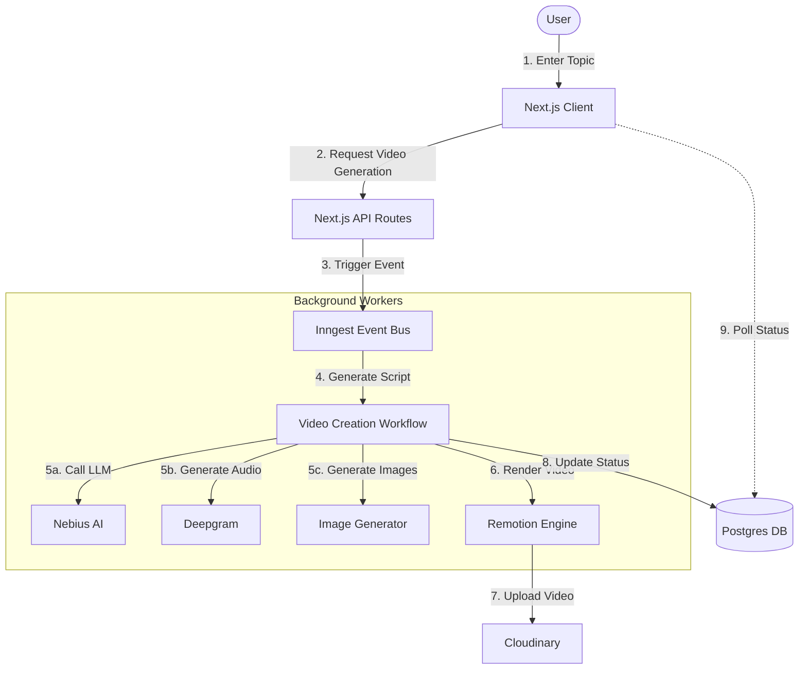

# Flickzo - AI Short Video Generator

Flickzo is a powerful platform that leverages advanced AI to transform text and ideas into professional short-form videos. Built with modern web technologies, it automates the entire video creation process—from scriptwriting and voice generation to visual synthesis and video editing.

## 🚀 Features

-   **AI Script Generation**: Automatically generates engaging video scripts based on user topics using LLMs.
-   **Lifelike Voiceovers**: Converts text to speech using high-quality AI audio generation (Deepgram).
-   **Visual Synthesis**: Generates relevant imagery to match the script content.
-   **Automated Video Editing**: Stitches together audio, images, and captions into a polished video using Remotion.
-   **Background Processing**: Handles complex generation tasks asynchronously using Inngest.
-   **Responsive Design**: A beautiful, modern interface built with Tailwind CSS and Next.js.

## 🛠️ Tech Stack

-   **Framework**: [Next.js 15](https://nextjs.org/) (App Router)
-   **Language**: [TypeScript](https://www.typescriptlang.org/)
-   **Styling**: [Tailwind CSS](https://tailwindcss.com/)
-   **Database**: [PostgreSQL](https://www.postgresql.org/) (via [Prisma ORM](https://www.prisma.io/))
-   **Video Engine**: [Remotion](https://www.remotion.dev/)
-   **Background Jobs**: [Inngest](https://www.inngest.com/)
-   **AI Services**:
    -   **LLM**: Nebius AI
    -   **Audio**: Deepgram
    -   **Storage/Media**: Cloudinary

## 🏗️ Architecture



## ⚡ Getting Started

### Prerequisites

-   Node.js (v18+)
-   Bun (recommended) or npm/pnpm
-   PostgreSQL database
-   Accounts for: Deepgram, Nebius AI, Cloudinary

### Installation

1.  **Clone the repository**

    ```bash
    git clone https://github.com/lwshakib/flickzo-short-video-generator.git
    cd flickzo-short-video-generator
    ```

2.  **Install dependencies**

    ```bash
    bun install
    ```

3.  **Environment Setup**

    Create a `.env` file based on `.env.example` and populate it with your keys:

    ```bash
    DATABASE_URL="postgresql://..."
    NEXT_PUBLIC_CLOUDINARY_CLOUD_NAME="..."
    DEEPGRAM_API_KEY="..."
    NEBIUS_API_KEY="..."
    # Add other necessary keys
    ```

4.  **Database Setup**

    ```bash
    bun prisma generate
    bun prisma db push
    ```

5.  **Run the Development Server**

    ```bash
    bun dev
    ```

    Open [http://localhost:3000](http://localhost:3000) to view the app.

6.  **Run Inngest Dev Server** (for background jobs)

    ```bash
    bun x inngest-cli@latest dev
    ```

## 🤝 Contributing

We welcome contributions! Please check out our [Contributing Guide](CONTRIBUTING.md) for details on how to get started.

Please adhere to our [Code of Conduct](CODE_OF_CONDUCT.md) in all interactions.

## 📄 License

This project is licensed under the MIT License - see the [LICENSE](LICENSE) file for details.

## 👤 Author

**lwshakib**

-   GitHub: [@lwshakib](https://github.com/lwshakib)
