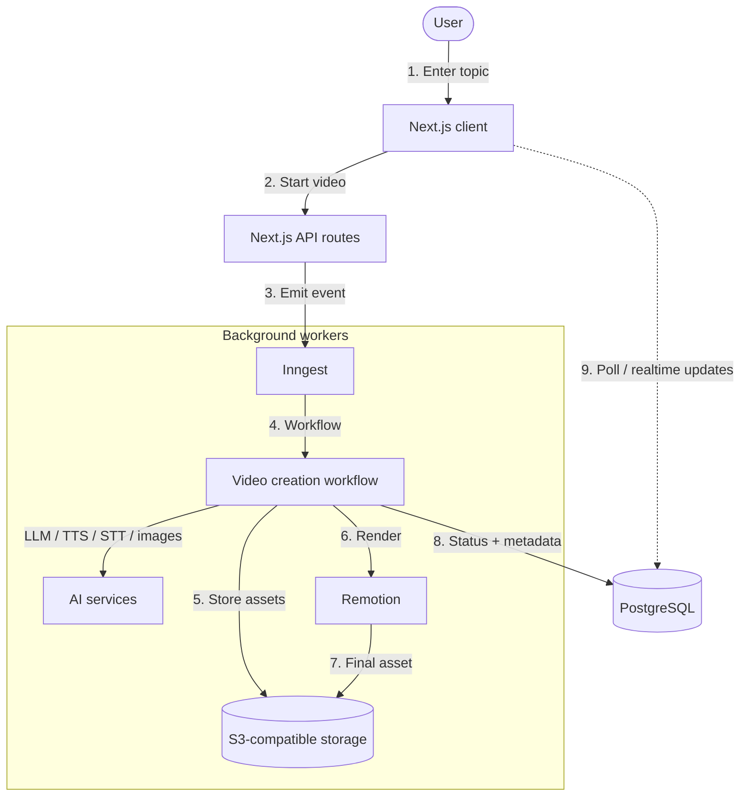

#  Flickzo - AI Cinematic Video Explorer

Flickzo is a platform that uses AI to turn text and ideas into short cinematic videos. It automates scripting, voice synthesis, imagery, captions, and final render (Remotion), with heavy work done in the background (Inngest).


## Features

- **AI script generation**: Scripts from a topic or brief via an LLM (Google AI API).
- **Voice & captions**: Text-to-speech and transcription (e.g. Deepgram) wired through the pipeline.
- **Visual synthesis**: Image generation aligned to the script, stored on S3-compatible object storage.
- **Automated editing**: Remotion composes audio, images, and captions into a finished video.
- **Background jobs**: Inngest runs long workflows reliably outside the request/response cycle.
- **Auth & accounts**: Better Auth with Google OAuth; daily free-tier limits for video starts.
- **UI**: Next.js App Router, React, Tailwind CSS.

## Tech stack

- **Framework**: [Next.js](https://nextjs.org/) (App Router)
- **Language**: [TypeScript](https://www.typescriptlang.org/)
- **Styling**: [Tailwind CSS](https://tailwindcss.com/)
- **Database**: [PostgreSQL](https://www.postgresql.org/) with [Prisma](https://www.prisma.io/)
- **Video**: [Remotion](https://www.remotion.dev/)
- **Jobs**: [Inngest](https://www.inngest.com/)
- **Storage**: AWS S3–compatible APIs (e.g. **Cloudflare R2**)
- **AI**: Google AI API (Gemini and related models; wire-up as configured in code)

## Architecture


```mermaid
graph TD
    User([User]) -->|1. Enter topic| Client[Next.js client]
    Client -->|2. Start video| API[Next.js API routes]
    API -->|3. Emit event| Inngest[Inngest]

    subgraph "Background workers"
        Inngest -->|4. Workflow| Workflow[Video creation workflow]
        Workflow -->|LLM / TTS / STT / images| AIServices[AI services]
        Workflow -->|5. Store assets| S3[(S3-compatible storage)]
        Workflow -->|6. Render| Remotion[Remotion]
    end

    Remotion -->|7. Final asset| S3
    Workflow -->|8. Status + metadata| DB[(PostgreSQL)]

    Client -.->|9. Poll / realtime updates| DB
```

## Prerequisites

- **Node.js** 20+ (LTS recommended; Next 16 expects a current runtime)
- **[Bun](https://bun.sh/)** (used in scripts and docs here; npm/pnpm can run equivalent commands)
- **PostgreSQL** reachable from your machine (local install, Docker, or hosted)
- **Accounts / keys** for: Google OAuth (sign-in), Google API key (`GOOGLE_API_KEY` for AI features), S3-compatible bucket, [Resend](https://resend.com/) (email), and [Inngest](https://www.inngest.com/) (background jobs; local dev uses the Inngest dev server)

## Installation

1. **Clone the repository**

   ```bash
   git clone https://github.com/lwshakib/flickzo-short-video-generator.git
   cd flickzo-short-video-generator
   ```

2. **Install dependencies**

   ```bash
   bun install
   ```

   This runs `prisma generate` via the `postinstall` script.

3. **Configure environment variables**

   Copy one of the example files and fill in real values:

   ```bash
   cp .env.example .env
   ```

   For local overrides (optional), you can mirror the same variables in `.env.local` using [.env.local.example](.env.local.example) as a template.

   See [.env.example](.env.example) for all variable names. At minimum you need a valid `DATABASE_URL`, auth-related values (`BETTER_AUTH_SECRET`, `NEXT_PUBLIC_BASE_URL`, `BETTER_AUTH_URL`, Google OAuth client ID/secret), AWS/S3 fields for your bucket, `GOOGLE_API_KEY`, and `RESEND_API_KEY`.

4. **Create the database schema**

   From a clean database, apply migrations:

   ```bash
   bun x prisma migrate dev
   ```

   If you only need a quick local schema without migration history management, you can use `bun x prisma db push` instead (not recommended for production).

5. **(Optional) Create the S3 bucket and CORS**

   If your project uses the provided scripts and env vars are set:

   ```bash
   bun run bucket:setup
   ```

## Running locally

1. **Start the Next.js dev server**

   ```bash
   bun dev
   ```

   Open [http://localhost:3000](http://localhost:3000).

2. **Start the Inngest dev server** (separate terminal)

   Video generation depends on Inngest functions being available:

   ```bash
   bun x inngest-cli@latest dev
   ```

   Point it at your app URL if prompted (typically `http://localhost:3000`).

3. **Production build** (sanity check)

   ```bash
   bun run build
   bun start
   ```

## Contributing

We welcome contributions. Read [CONTRIBUTING.md](CONTRIBUTING.md) for fork/clone/branch/PR workflow and expectations. Please follow [CODE_OF_CONDUCT.md](CODE_OF_CONDUCT.md).

## License

This project is licensed under the MIT License — see [LICENSE](LICENSE).

## Author

**lwshakib** — GitHub: [@lwshakib](https://github.com/lwshakib)
